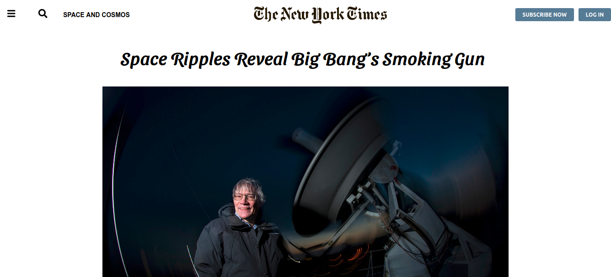

# Positioning-and-Floating-Elements-Project-

Making a clone of a New York Times article page.

Clone of a New York Times article page. [article page](https://www.nytimes.com/2014/03/18/science/space/detection-of-waves-in-space-buttresses-landmark-theory-of-big-bang.html?_r=0)

## Built With

- Html
- Css

## Live Demo

[Live Demo Link] (https://ammarkandel.github.io/Positioning-and-Floating-Elements-Project-/)

👤 **Ammar El refay Kandel**

- GitHub: [ammarkandel](https://github.com/ammarkandel)
- Twitter: [@AmmarQandel](https://twitter.com/AmmarQandel)
- LinkedIn: [LinkedIn](https://www.linkedin.com/in/ammar-kandel-7b4100193/)

👤 **Kalu Chinasa Agu**

- GitHub: [@Nasa](https://github.com/Nasa28)
- Twitter: [@Ultimate_Nasa](https://twitter.com/Ultimate_Nasa)
- LinkedIn: [LinkedIn](https://www.linkedin.com/in/kalu-chinasa-agu-a15080103/)

#### Contributions, issues and feature requests are welcome! Start by:

- Push your branch up to your forked repository
- Open a Pull Request with a detailed description to the development branch of the original project for a review

## Show your support

Give a ⭐️ if you like this project!

## Acknowledgments

- Microverse
